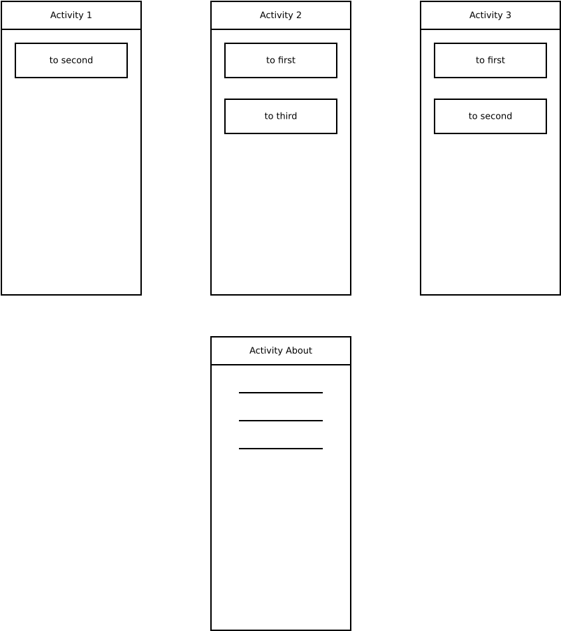
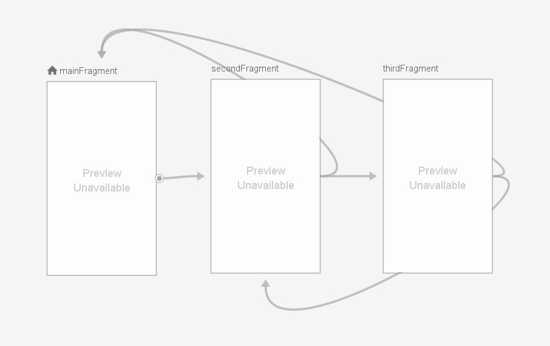

# Лабораторная работа №3. Lifecycle компоненты. Навигация в приложении.  
## Цели  
* Ознакомиться с методом обработки жизненного цикла activity/fragment при помощи Lifecycle-Aware компонентов    
* Изучить основные возможности навигации внутри приложения: создание новых activity, navigation graph  
  
## Задачи  
### Задача 1. Обработка жизненного цикла с помощью Lifecycle-Aware компонентов  
#### Задание  
Ознакомиться с Lifecycle-Aware Components по документации: https://developer.android.com/topic/libraries/architecture/lifecycle и выполнить codelabs

**ViewModel** - класс, позволяющий сохранять данные при изменении конфигурации устройства. Цель ViewModel - получить и сохранить информацию, необходимую для Activity или фрагмента. Activity или фрагмент должны иметь возможность наблюдать изменения в ViewModel. Единственная задача ViewModel - управлять данными для пользовательского интерфейса. Этот класс никогда не должен обращаться к иерархии view или содержать обратную ссылку на Activity или Fragment.
**Lifecycle** - класс, содержащий информацию о состоянии жизненного цикла компонента (Activity или фрагмента) и позволяющий другим объектам наблюдать за этим состоянием.
**LifecycleOwner** - это интерфейс с одним методом getLifecycle(), который возвращает состояние жизненного цикла. Являет собой абстракцию владельца жизненного цикла (Activity, Fragment).
**LiveData** - класс, позволяющий наблюдать за изменениями данных в нескольких компонентах вашего приложения, не создавая явных жёстких путей зависимости между ними. Подписчиками LiveData являются Activity и фрагменты. 

#### Какую информацию удалось усвоить?
* При изменении конфигурации, Activity будет пересоздаваться, а объект MyViewModel продолжит находиться в провайдере. Activity после пересоздания сможет получить этот объект обратно и продолжить работу.
* LiveData принимает подписчика и уведомляет его об изменениях данных, только когда он находится в состоянии STARTED или RESUMED.
* Научилась убивать процессы 👍
* Некоторые элементы пользовательского интерфейса могут сохранять свое состояние, используя собственную onSaveInstanceState реализацию
* По неведомым мне причинам последний этап не работает так, как указано. Даже при запуске эталонного решения

  
### Задача 2. Навигация (startActivityForResult)
#### Задание
Реализовать навигацию между экранами одного приложения согласно изображению ниже с помощью Activity, Intent и метода `startActivityForResult`.

#### Пояснения
* Приложение начинает работу с отображения Activity 1
* Кнопка 'to first' отображает на экране Activity 1
* Кнопка 'to second' отображает на экране Activity 2
* Кнопка 'to third' отображает на экране Activity 3
* В любой момент в backstack любого task приложения должно быть не более 4 activity
* Во всех вариантах Activity 'About' должна быть доступна из любой другой Activity одним из способов согласно варианту.
* (27.10.2019) Activity в BackStack (кроме About) всегда остаются в одном и том же порядке: 1-2-3 

#### Варианты задания
Во всех вариантах Activity 'About' должна быть доступна из любой другой Activity с помощью Bottom Navigation

Листинг MainActivity (First Activity)

    package com.example.lab3_2

    import android.content.Intent
    import android.os.Bundle
    import androidx.appcompat.app.AppCompatActivity
    import com.example.lab3_2.databinding.ActivityMainBinding

    class MainActivity : AppCompatActivity() {
        override fun onCreate(savedInstanceState: Bundle?) {
            super.onCreate(savedInstanceState)

        val binding = ActivityMainBinding.inflate(layoutInflater)
        setContentView(binding.root)

        binding.bnGoTo2.setOnClickListener {
            val intent = Intent(this, SecondActivity::class.java)
            startActivity(intent)
        }
        binding.bottomNav.setOnNavigationItemSelectedListener { item ->
            when (item.itemId) {
                R.id.about -> {
                    startActivity(Intent(this, AboutActivity::class.java))
                }
            }
            false
        }
      }
     }

Листинг SecondActivity:

    package com.example.lab3_2

    import android.app.Activity
    import android.content.Intent
    import android.os.Bundle
    import androidx.appcompat.app.AppCompatActivity
    import com.example.lab3_2.databinding.ActivitySecondBinding

    class SecondActivity : AppCompatActivity() {
        override fun onCreate(savedInstanceState: Bundle?) {
            super.onCreate(savedInstanceState)

        val binding = ActivitySecondBinding.inflate(layoutInflater)
        setContentView(binding.root)

        binding.bnGoTo1.setOnClickListener {
            finish()
        }

        binding.bnGoTo3.setOnClickListener {
            val intent = Intent(this, ThirdActivity::class.java)
            startActivityForResult(intent, 2)
        }
        binding.bottomNav.setOnNavigationItemSelectedListener { item ->
            when (item.itemId) {
                R.id.about -> {
                    startActivity(Intent(this, AboutActivity::class.java))
                }
            }
            false
        }
    }

    override fun onActivityResult(requestCode: Int, resultCode: Int, data: Intent?) {
        super.onActivityResult(requestCode, resultCode, data)
        if (requestCode == 2) {
            if (resultCode == 1) {
                finish()
            }
        }
     }
    }

Листинг ThirdActivity:

    package com.example.lab3_2

    import android.app.Activity
    import android.content.Intent
    import android.os.Bundle
    import androidx.appcompat.app.AppCompatActivity
    import com.example.lab3_2.databinding.ActivityThirdBinding

    class ThirdActivity : AppCompatActivity() {
        override fun onCreate(savedInstanceState: Bundle?) {
            super.onCreate(savedInstanceState)

        val binding = ActivityThirdBinding.inflate(layoutInflater)
        setContentView(binding.root)

        binding.bnGoTo1.setOnClickListener {
            setResult(1)
            finish() 
        }
        binding.bnGoTo2.setOnClickListener {
            finish()
        }
        binding.bottomNav.setOnNavigationItemSelectedListener { item ->
            when (item.itemId) {
                R.id.about -> {
                    startActivity(Intent(this, AboutActivity::class.java))
                }
            }
            false
        }
     }
    }

Листинг AboutActivity:

    package com.example.lab3_2

    import android.os.Bundle
    import androidx.appcompat.app.AppCompatActivity
    import com.example.lab3_2.databinding.ActivityAboutBinding

    class AboutActivity : AppCompatActivity() {
        override fun onCreate(savedInstanceState: Bundle?) {
            super.onCreate(savedInstanceState)

        val binding = ActivityAboutBinding.inflate(layoutInflater)
        setContentView(binding.root)
     }
    }

Листинг activity_main.xml:

    <?xml version="1.0" encoding="utf-8"?>
    <androidx.constraintlayout.widget.ConstraintLayout xmlns:android="http://schemas.android.com/apk/res/android"
        xmlns:app="http://schemas.android.com/apk/res-auto"
        xmlns:tools="http://schemas.android.com/tools"
        android:layout_width="match_parent"
        android:layout_height="match_parent"
        tools:context=".MainActivity">

    <Button
        android:id="@+id/bnGoTo2"
        android:layout_width="match_parent"
        android:layout_height="wrap_content"
        android:text="to second"
        app:layout_constraintBottom_toBottomOf="parent"
        app:layout_constraintEnd_toEndOf="parent"
        app:layout_constraintStart_toStartOf="parent"
        app:layout_constraintTop_toTopOf="parent"
        app:layout_constraintVertical_bias="0.2" />

    <com.google.android.material.bottomnavigation.BottomNavigationView
        android:id="@+id/bottomNav"
        android:layout_width="match_parent"
        android:layout_height="wrap_content"
        android:background="#FFFFFF"
        app:itemTextColor="#000000"
        app:layout_constraintBottom_toBottomOf="parent"
        app:layout_constraintTop_toTopOf="parent"
        app:layout_constraintVertical_bias="1"
        app:menu="@menu/menu_nav" />

    </androidx.constraintlayout.widget.ConstraintLayout>

Листинг activity_second.xml:

    <?xml version="1.0" encoding="utf-8"?>
    <androidx.constraintlayout.widget.ConstraintLayout
        xmlns:android="http://schemas.android.com/apk/res/android"
        xmlns:app="http://schemas.android.com/apk/res-auto"
        android:layout_width="match_parent"
        android:layout_height="match_parent">

    <Button
        android:id="@+id/bnGoTo1"
        android:layout_width="match_parent"
        android:layout_height="wrap_content"
        android:layout_marginTop="100dp"
        android:text="to first"
        app:layout_constraintTop_toTopOf="parent"
        />

    <Button
        android:id="@+id/bnGoTo3"
        android:layout_width="match_parent"
        android:layout_height="wrap_content"
        android:layout_marginTop="180dp"
        android:text="to third"
        app:layout_constraintTop_toTopOf="parent"
        />

    <com.google.android.material.bottomnavigation.BottomNavigationView
        android:id="@+id/bottomNav"
        android:layout_width="match_parent"
        android:layout_height="wrap_content"
        android:background="#FFFFFF"
        app:itemTextColor="#000000"
        app:layout_constraintBottom_toBottomOf="parent"
        app:layout_constraintTop_toTopOf="parent"
        app:layout_constraintVertical_bias="1"
        app:menu="@menu/menu_nav" />

    </androidx.constraintlayout.widget.ConstraintLayout>

Листинг activity_third.xml:

    <?xml version="1.0" encoding="utf-8"?>
    <androidx.constraintlayout.widget.ConstraintLayout
        xmlns:android="http://schemas.android.com/apk/res/android"
        xmlns:app="http://schemas.android.com/apk/res-auto"
        android:layout_width="match_parent"
        android:layout_height="match_parent">

    <Button
        android:id="@+id/bnGoTo1"
        android:layout_width="match_parent"
        android:layout_height="wrap_content"
        android:layout_marginTop="100dp"
        android:text="to first"
        app:layout_constraintTop_toTopOf="parent"
        />

    <Button
        android:id="@+id/bnGoTo2"
        android:layout_width="match_parent"
        android:layout_height="wrap_content"
        android:layout_marginTop="180dp"
        android:text="to second"
        app:layout_constraintTop_toTopOf="parent"
        />

    <com.google.android.material.bottomnavigation.BottomNavigationView
        android:id="@+id/bottomNav"
        android:layout_width="match_parent"
        android:layout_height="wrap_content"
        android:background="#FFFFFF"
        app:itemTextColor="#000000"
        app:layout_constraintBottom_toBottomOf="parent"
        app:layout_constraintTop_toTopOf="parent"
        app:layout_constraintVertical_bias="1"
        app:menu="@menu/menu_nav" />

    </androidx.constraintlayout.widget.ConstraintLayout>

Листинг activity_about.xml:

    <?xml version="1.0" encoding="utf-8"?>
    <androidx.constraintlayout.widget.ConstraintLayout
        xmlns:android="http://schemas.android.com/apk/res/android"
        xmlns:app="http://schemas.android.com/apk/res-auto"
        android:layout_width="match_parent"
        android:layout_height="match_parent">

    <TextView
        android:id="@+id/textView"
        android:layout_width="wrap_content"
        android:layout_height="wrap_content"
        android:text="Something about activity"
        app:layout_constraintBottom_toBottomOf="parent"
        app:layout_constraintEnd_toEndOf="parent"
        app:layout_constraintStart_toStartOf="parent"
        app:layout_constraintTop_toTopOf="parent"
        app:layout_constraintHorizontal_bias="0.5"
        app:layout_constraintVertical_bias="0.5" />
    </androidx.constraintlayout.widget.ConstraintLayout>

Листинг menu_nuv.xml:

    <?xml version="1.0" encoding="utf-8"?>
    <menu xmlns:android="http://schemas.android.com/apk/res/android">

    <item
        android:id="@+id/about"
        android:icon="@drawable/sentiment_satisfied"
        android:title="Activity about"
        />
    </menu>

Если не указать все Activty в Манифесте, то приложение закроется при попытке перейти в незарегистрированное Activity.

### Задача 3. Навигация (флаги Intent/атрибуты Activity)
#### Задание
Решить предыдущую задачу с помощью Activity, Intent и флагов Intent либо атрибутов Activity.

Для решения задачи был использован FLAG_ACTIVITY_CLEAR_TOP. При его установке наблюдается следующее поведение: если в таске уже существует вызываемая Activity, то все Activity, что находились выше в стеке - будут уничтожены.

Файл MainActivity остаётся без изменений.

В SecondActivity меняем меняем listener кнопки перехода в 3-е activity:

    binding.bnGoTo3.setOnClickListener {
                val intent = Intent(this, ThirdActivity::class.java)
                startActivity(intent)
            }

В ThirdActivity меняем listener кнопки перехода в 1-е activity:

    binding.bnGoTo1.setOnClickListener {
                val intent = Intent(this, MainActivity::class.java)
                intent.addFlags(Intent.FLAG_ACTIVITY_CLEAR_TOP)
                startActivity(intent)
            }

### Задача 4. Навигация (флаги Intent/атрибуты Activity)
Дополнить граф навигации новым(-и) переходом(-ами) с целью демонстрации какого-нибудь (на свое усмотрение) атрибута Activity или флага Intent, который еще не использовался для решения задачи. Поясните пример и работу флага/атрибута.

**launchMode** - атрибут Activity, который может принимать значения: standard, singleTop, singleTask, singleInstance. Определяет поведение запущенного Activity (управляет стеком)
1. standart - режим «по умолчанию». В этом режиме всегда будет создаваться новая Activity, чтобы работать отдельно с каждым отправленным Intent.
2. singleTop - ведет себя так же, как и standard. Единственное отличие состоит в том, что новая Activity будет создана, только если такая Activity уже не на вершине стека. В противном случае будет вызван метод onNewIntent().
3. singleTask - Activity разрешено иметь единственный экземпляр в системе. Если уже существует экземпляр Activity, задача, удерживающая экземпляр, будет сохранена, а Intent обновлён через onNewIntent(). Все activity,что находились выше singleTask Activity - будут уничтожены. 
В противном случае, будет создана новая Activity и помещена в соответствующую задачу.
4. singleInstance - задача, которая располагает singleInstance Activity, может иметь только одну Activity — ту, у которой атрибут singleInstance. Если из этого вида Activity вызывается другая Activity, автоматически создается новое задание для размещения новой Activity. Аналогичным образом, если вызывается singleInstance Activity, будет создана новая задача для размещения этой Activity.
Тут я не особо поняла, что происходит. Чисто визуально я вижу, что Activity с таким атрибутом "выплывают" по другому, но существенных особенностей не заметила.

Попробовала установить каждый атрибут. Первые два было легко наблюдать, а вот работу singleTask представляю только в теории. Для полного теста нужно второе приложение, чтобы было два таска.
При установке singleInstance на третью Activity заметила иную анимации при открытии ThirdActivity. При попытке перейти из неё в SecondActivity приложение закрывается, так как ThirdActivity была открыта в новом таске, в котором являлась корневой. Нас вернуло в начальный таск,  о чём говорит соответствующая анимация перехода. Но я думала, что таски можно будет наблюдать при нажатии на Overview. В моём представлении при открытии третьей активити, начальный таск должен был уйти "на фон", но я его не вижу.

### Задача 5. Навигация (Fragments, Navigation Graph) 
Решить предыдущую задачу (с расширенным графом) с использованием navigation graph. Все Activity должны быть заменены на фрагменты, кроме Activity 'About', которая должна остаться самостоятельной Activity.
В отчете сравните все решения.

Листинг MainActivity:

    class MainActivity : AppCompatActivity() {
        override fun onCreate(savedInstanceState: Bundle?) {
            super.onCreate(savedInstanceState)
            
        val binding = ActivityMainTask5Binding.inflate(layoutInflater) //5
        setContentView(binding.root)

        val navHostFragment = supportFragmentManager.findFragmentById(R.id.nav_host) as NavHostFragment
        val navController = navHostFragment.navController

        binding.bottomNav.setOnNavigationItemSelectedListener { item ->
            when (item.itemId) {
                R.id.about -> {
                    startActivity(Intent(this, AboutActivity::class.java))
                }
            }
            false
        }
    }
    
Листинг MainFragment:

    class MainFragment: Fragment() {
        override fun onCreateView(
            inflater: LayoutInflater,
            container: ViewGroup?,
            savedInstanceState: Bundle?
        ): View? {
            super.onCreateView(inflater, container, savedInstanceState)
            val view = inflater.inflate(R.layout.fragment_first, container, false)

        view.bnGoTo2.setOnClickListener {
            Navigation.findNavController(view).navigate(R.id.action_mainFragment_to_secondFragment)
        }
        
        return view
    }
    }
    
Листинг SecondFragment:

    class SecondFragment : Fragment() {
        override fun onCreateView(
            inflater: LayoutInflater,
            container: ViewGroup?,
            savedInstanceState: Bundle?
        ): View? {
            super.onCreateView(inflater, container, savedInstanceState)
            val view = inflater.inflate(R.layout.fragment_second, container, false)

        view.bnGoTo1.setOnClickListener {
            Navigation.findNavController(view).navigate(R.id.action_secondFragment_to_mainFragment)
        }

        view.bnGoTo3.setOnClickListener {
            Navigation.findNavController(view).navigate(R.id.action_secondFragment_to_thirdFragment)
        }
        return view
    }
    }
  
Листинг ThirdFragment:

    class ThirdFragment : Fragment() {
        override fun onCreateView(
            inflater: LayoutInflater,
            container: ViewGroup?,
            savedInstanceState: Bundle?
        ): View? {
            super.onCreateView(inflater, container, savedInstanceState)
            val view = inflater.inflate(R.layout.fragment_third, container, false)

        view.bnGoTo1.setOnClickListener {
            Navigation.findNavController(view).navigate(R.id.action_thirdFragment_to_mainFragment)
        }
        view.bnGoTo2.setOnClickListener {
            Navigation.findNavController(view).navigate(R.id.action_thirdFragment_to_secondFragment)
        }
        return view
    }
    }
    
Листинг activity_main_task5.xml:

    <?xml version="1.0" encoding="utf-8"?>
    <androidx.constraintlayout.widget.ConstraintLayout xmlns:android="http://schemas.android.com/apk/res/android"
        android:layout_width="match_parent"
        android:layout_height="match_parent"
        xmlns:app="http://schemas.android.com/apk/res-auto">

    <androidx.fragment.app.FragmentContainerView
        android:layout_width="match_parent"
        android:layout_height="match_parent"
        android:id="@+id/nav_host"
        android:name="androidx.navigation.fragment.NavHostFragment"

        app:defaultNavHost="true"
        app:navGraph="@navigation/nav_graph"
        />

    <com.google.android.material.bottomnavigation.BottomNavigationView
        android:id="@+id/bottomNav"
        android:layout_width="match_parent"
        android:layout_height="wrap_content"
        android:background="#FFFFFF"
        app:itemTextColor="#000000"
        app:layout_constraintBottom_toBottomOf="parent"
        app:layout_constraintTop_toTopOf="parent"
        app:layout_constraintVertical_bias="1"
        app:menu="@menu/menu_nav" />

    </androidx.constraintlayout.widget.ConstraintLayout>
    
Листинг fragment_first.xml:

    <?xml version="1.0" encoding="utf-8"?>
    <androidx.constraintlayout.widget.ConstraintLayout xmlns:android="http://schemas.android.com/apk/res/android"
        android:layout_width="match_parent"
        android:layout_height="match_parent"
        xmlns:app="http://schemas.android.com/apk/res-auto">

    <Button
        android:id="@+id/bnGoTo2"
        android:layout_width="match_parent"
        android:layout_height="wrap_content"
        android:text="to second"
        app:layout_constraintBottom_toBottomOf="parent"
        app:layout_constraintEnd_toEndOf="parent"
        app:layout_constraintStart_toStartOf="parent"
        app:layout_constraintTop_toTopOf="parent"
        app:layout_constraintVertical_bias="0.2" />

    </androidx.constraintlayout.widget.ConstraintLayout>
    
Листинг fragment_second.xml:

    <?xml version="1.0" encoding="utf-8"?>
    <androidx.constraintlayout.widget.ConstraintLayout xmlns:android="http://schemas.android.com/apk/res/android"
        android:layout_width="match_parent"
        android:layout_height="match_parent"
        xmlns:app="http://schemas.android.com/apk/res-auto">

    <Button
        android:id="@+id/bnGoTo1"
        android:layout_width="match_parent"
        android:layout_height="wrap_content"
        android:layout_marginTop="100dp"
        android:text="to first"
        app:layout_constraintTop_toTopOf="parent"
        />

    <Button
        android:id="@+id/bnGoTo3"
        android:layout_width="match_parent"
        android:layout_height="wrap_content"
        android:layout_marginTop="180dp"
        android:text="to third"
        app:layout_constraintTop_toTopOf="parent"
        />

       </androidx.constraintlayout.widget.ConstraintLayout>
    
Листин fragment_third.xml:

    <?xml version="1.0" encoding="utf-8"?>
    <androidx.constraintlayout.widget.ConstraintLayout xmlns:android="http://schemas.android.com/apk/res/android"
        android:layout_width="match_parent"
        android:layout_height="match_parent"
        xmlns:app="http://schemas.android.com/apk/res-auto">

    <Button
        android:id="@+id/bnGoTo1"
        android:layout_width="match_parent"
        android:layout_height="wrap_content"
        android:layout_marginTop="100dp"
        android:text="to first"
        app:layout_constraintTop_toTopOf="parent"
        />

    <Button
        android:id="@+id/bnGoTo2"
        android:layout_width="match_parent"
        android:layout_height="wrap_content"
        android:layout_marginTop="180dp"
        android:text="to second"
        app:layout_constraintTop_toTopOf="parent"
        />

    </androidx.constraintlayout.widget.ConstraintLayout>

Вид Navigation Graph:

    
### Выводы

В ходе данной лабораторной работы были изучены различные Lifecycle-Aware Components - компоненты, которые выполняют действия в ответ на изменение статуса жизненного цикла другого компонента (Activity или фрагмента): LifecycleOwner и LifecycleObserver.
Наблюдение за состоянием компонента осуществляется с помощью пакета androidx.lifecycle, содержащего классы и интерфейсы, которые позволяют строить lifecycle-aware компоненты, которые могут автоматически корректировать поведение в зависимости от текущего состояния в течение жизненного цикла Activity или фрагмента. 
Также были изученые различные методы навигации в приложении:
* навигация с помощью стандартных методов Android SDK: startActivity(), finish(), startActivityForResult(), onActivityResult();
* Bottom Navigation;
* навигация с помощью стандартных методов SDK и флагов Intent;
* навигация c использованием фрагментов.
 
